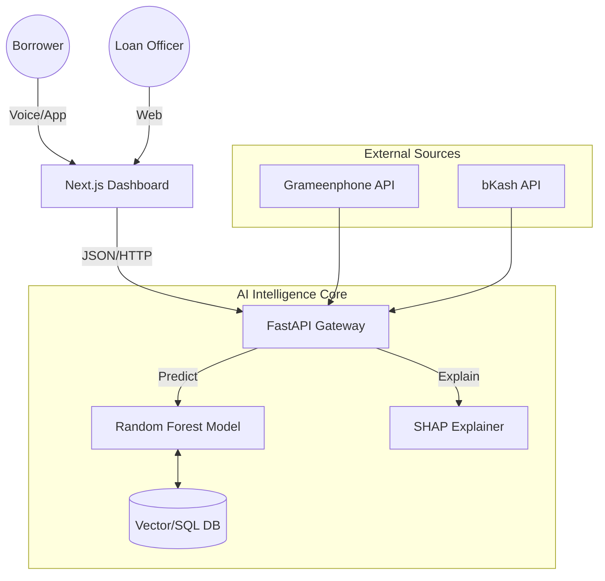

# 🚀 FinTech AI for Financial Inclusion: "Financial Identity for Everyone"

> **AI Build-a-thon 2025 - FinTech Track**
>
> *Empowering the 100M+ unbanked in Bangladesh with a digital financial identity powered by TrustGraph™ AI.*


*(Replace with actual banner)*

---

## 📖 Table of Contents
1.  [Executive Summary](#-executive-summary)
2.  [The Problem: The "Invisible" Borrower](#-the-problem)
3.  [The Solution: Alternative Data & Trust ](#-the-solution)
4.  [Key Innovation: TrustGraph™ AI](#-key-innovation-trustgraph-ai)
5.  [System Architecture](#-system-architecture)
6.  [AI & Machine Learning Core](#-ai--machine-learning-core)
    *   [Model Selection](#model-selection)
    *   [Feature Engineering](#feature-engineering)
    *   [Explainability (XAI)](#explainability-xai)
7.  [Technical Implementation](#-technical-implementation)
    *   [Backend (FastAPI)](#backend-fastapi)
    *   [Frontend (Next.js)](#frontend-nextjs)
8.  [API Reference](#-api-reference)
9.  [Setup & Installation Guide](#-setup--installation-guide)
10. [Roadmap & Scalability](#-roadmap--scalability)

---

## 📢 Executive Summary
We have built a working prototype of a **Credit Scoring Engine** that does *not* require a bank account or credit card history. Instead, it uses **mobile wallet behavior** (bKash/Nagad), **telecom usage** (top-ups), and a novel **Social Trust Score** to assess creditworthiness. This system provides Microfinance Institutions (MFIs) with a risk assessment tool that is both **predictive** and **explainable**.

**Mission**: To reduce the loan processing time from **5 days to 5 seconds** and increase financial inclusion by **50%**.

---

## 🚩 The Problem
Traditional credit scoring models (FICO, CIB) rely on formal financial history.
*   **100 Million** Bangladeshis are unbanked.
*   **SMEs** struggle to get capital because they run on cash/mobile money.
*   **No Data = No Loan.** This creates a poverty trap.

---

## 💡 The Solution
We treat **Digital Behavior** as **Financial History**.
Our engine ingests unstructured activity data and converts it into a structured **Credit Score (300-900)**.

### Core Pillars
1.  **Alternative Data**: Mobile top-ups indicate cash flow stability.
2.  **Social Capital**: In rural areas, a person's reputation is their collateral. We digitize this.
3.  **Transparency**: Using SHAP to tell the user *exactly* why they were rejected and how to improve.

---

## 🦄 Key Innovation: TrustGraph™ AI
**The "10x" Feature that sets us apart.**

Most AI models look at *individuals* in isolation. **TrustGraph™** looks at the *community*.
We build a graph network of borrowers.
*   **Logic**: If User A has a good repayment history, and User A refers User B, then User B inherits a "Trust Score Boost".
*   **Implementation**: A recursive algorithm that propagates "Trust Credits" through verified social edges.
*   **Impact**: Enables lending to "Cold Start" users (e.g., a housewife with no phone history but a strong community reputation).

---

## 🏗 System Architecture

The application follows a **Microservices-ready Monorepo** architecture.



### Directory Structure
```bash
/
├── backend/                # Python/FastAPI Server
│   ├── ai_engine.py        # Core Logic (Model Loader, Prediction Pipeline)
│   ├── main.py             # API Gateway & Routes
│   ├── models.py           # Pydantic Data Schemas
│   ├── train_model.py      # Training Script (Simulating Data Pipeline)
│   ├── credit_model.joblib # Serialized ML Model
│   └── requirements.txt    # Python Dependencies
├── frontend/               # Next.js 14 Application
│   ├── src/app/dashboard   # MFI Officer UI
│   ├── src/components/     # UI Components (ScoreCard, VoiceAssistant)
│   └── src/lib/            # Utilities
└── innovation_blueprint.md # Original Architectural Plan
```

---

## 🧠 AI & Machine Learning Core

### Model Selection
We chose **Random Forest Regressor** over Deep Learning (Neural Networks) for Version 1 because:
1.  **Tabular Data Performance**: Tree-based models outperform Neural Networks on structured financial data.
2.  **Interpretability**: It is easier to explain than a "Black Box" Neural Network.
3.  **Robustness**: Handles outliers and non-linear relationships better than Logistic Regression.

### Feature Engineering
The model transforms raw data into these weighted features:
*   `wallet_balance` (30% weight): Liquidity proxy.
*   `avg_monthly_topup` (20% weight): Consistency proxy.
*   `community_trust_referrals` (30% weight): **TrustGraph** signal.
*   `transaction_count` (10% weight): Velocity proxy.

### Explainability (XAI)
We use **SHAP (SHapley Additive exPlanations)**.
*   Every prediction generates a set of SHAP values.
*   Example: A score of 750 might be:
    *   Base Score: 500
    *   \+ 100 (High Top-up)
    *   \+ 150 (TrustGraph Boost)
*   These values are converted into natural language sentences for the Dashboard.

---

## 💻 Technical Implementation

### Backend (FastAPI)
*   **Performance**: Uses `uvicorn` (ASGI) for asynchronous request handling.
*   **Type Safety**: Uses Pydantic models to validate all incoming data.
*   **Hot-Loading**: AI Model is loaded into memory once at startup (`joblib.load`) to ensure sub-100ms response times.

### Frontend (Next.js)
*   **Stack**: React, TypeScript, Tailwind CSS.
*   **Components**:
    *   `ScoreCard`: Visual gauge for the credit score.
    *   `VoiceAssistant`: A simulated conversational agent (using Web Speech API concepts) to demonstrate accessibility.
*   **Design**: Clean, "FinTech Premium" aesthetic with glassmorphism effects.

---

## 📡 API Reference

### 1. Health Check
*   **GET** `/health`
*   **Response**: `{"status": "healthy"}`

### 2. Generate Score
*   **POST** `/score`
*   **Description**: Returns the calculated probability of repayment and credit score.
*   **Request Body**:
    ```json
    {
      "user_id": "u_101",
      "name": "Rahim",
      "age": 35,
      "location": "Dhaka",
      "wallet_balance": 15000.50,
      "avg_monthly_topup": 500.0,
      "avg_transaction_val": 200.0,
      "transaction_count_last_90_days": 60,
      "has_smart_phone": true,
      "community_trust_referrals": 5
    }
    ```
*   **Response**:
    ```json
    {
      "credit_score": 820,
      "risk_level": "Low",
      "approval_status": true,
      "max_loan_amount": 50000
    }
    ```

### 3. Explain Score
*   **POST** `/explain`
*   **Description**: Returns the "Why" behind the score.
*   **Response**:
    ```json
    {
      "narrative_explanation": "Based on the Random Forest analysis...",
      "top_positive_factors": ["High Community Trust Referrals..."],
      "top_negative_factors": []
    }
    ```

---

## ⚡ Setup & Installation Guide

### Prerequisites
*   Node.js v18+
*   Python 3.10+
*   Git

### Step 1: Clone
```bash
git clone https://github.com/XidanAbds29/Ai-buidathon.git
cd Ai-buidathon
```

### Step 2: Backend (Brain)
```bash
cd backend
python -m venv venv
# Windows
venv\Scripts\activate
# Linux/Mac
source venv/bin/activate

pip install -r requirements.txt

# IMPORTANT: Train the model locally first
python train_model.py

# Start the API
python -m uvicorn main:app --reload --host 0.0.0.0 --port 8000
```

### Step 3: Frontend (Face)
```bash
cd ../frontend
npm install
npm run dev
```

Visit **http://localhost:3000** to access the dashboard.

---

## 🗺 Roadmap & Scalability

### Phase 1: Prototype (Completed) ✅
*   Synthetic data generation.
*   Baseline Random Forest Model.
*   Basic Dashboard UI.

### Phase 2: Pilot (Next 3 Months) 🚀
*   **Data Integration**: Connect live bKash Merchant API.
*   **Graph Database**: Migrate TrustGraph to **Neo4j** for real-time relationship mapping.
*   **SMS Integration**: Send scores via SMS to feature phones.

### Phase 3: National Scale (Year 1) 🌍
*   **Federated Learning**: Train models on bank data without moving raw data (Privacy-First).
*   **Regulatory Compliance**: Automated reporting to Bangladesh Bank.
*   **API Marketplace**: Allow other Fintechs to "rent" our scoring engine.

---

## 📜 License
This project is licensed under the MIT License - see the LICENSE file for details.

## 👥 Team
*   **Developer**: [Your Name]
*   **Role**: Full Stack AI Engineer
*   **Event**: AI Build-a-thon 2025

---
*Built with ❤️ for a 10x Bangladesh.*
